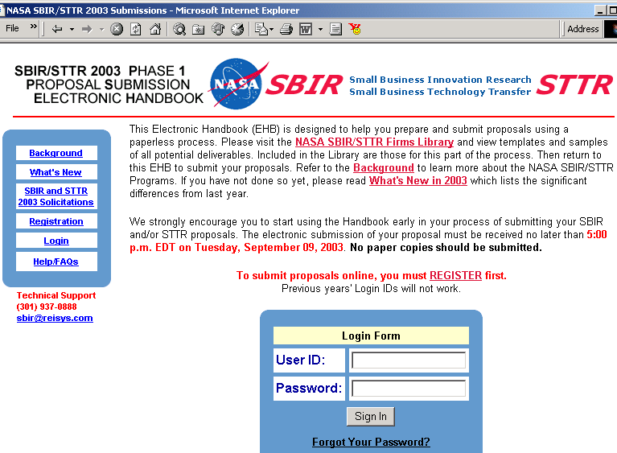
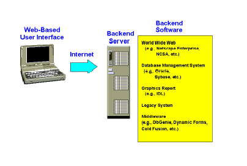
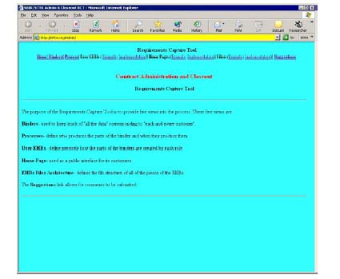
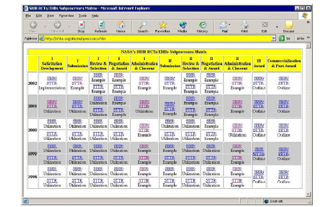
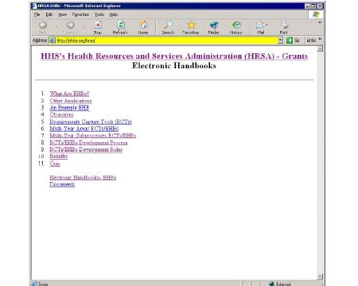

:toc: macro
:toc-title:
:toclevels: 3
:technical-proposal: true
:xrefstyle: short
////
Technical Proposal Template

This part of the submission should not contain any budget data and must consist of all ten (10) parts
listed below in the given order. All ten parts of the technical proposal must be numbered and titled.
Parts that are not applicable must be included and marked “Not Applicable.” A proposal omitting any
part will be considered non-responsive to this solicitation and may be rejected during administrative
screening. The required table of contents is provided below.

Page Limitations and Margins: A Phase I technical proposal shall not exceed a total of 19 standard 8 1/2
x 11 inch (21.6 x 27.9 cm) pages. Each page shall be numbered consecutively at the bottom. Margins
shall be 1.0 inch (2.5 cm). The space allocated to each part of the technical content will depend on the
project chosen and the offeror's approach.

Type Size: No type size smaller than 10 point shall be used for text or tables, except as legends on
reduced drawings. Proposals prepared with smaller font sizes may be rejected without consideration.

Header/Footer Requirements: Header must include firm name, proposal number and project title.
Footer must include the page number and proprietary markings if applicable. Margins can be used for
header/footer information.
////

=== Part 1: Table of Contents ===
toc::[]

<<<

=== Part 2: Identification and Significance of the Innovation ===
////
Succinctly describe:
• The proposed innovation.
• The relevance and significance of the proposed innovation to an interest, need or needs, within a
subtopic described in section 9.
• The proposed innovation relative to the state of the art.
////

include::identification-and-significance-of-the-innovation.adoc[]

=== Part 3: Technical Objectives === 
////
State the specific objectives of the Phase I R/R&D effort including the technical questions posed in the
subtopic description that must be answered to determine the feasibility of the proposed innovation.
////
The technical objectives of EHBs are to:

include::technical-objectives.adoc[]

=== Part 4: Work Plan ===
////
Include a detailed description of the Phase I R/R&D plan to meet the technical objectives. The plan should
indicate what will be done, where it will be done and how the R/R&D will be carried out. Discuss in detail
the methods planned to achieve each task or objective. Task descriptions, schedules, resource
allocations, estimated task hours for each key personnel and planned accomplishments including project
milestones shall be included. Offerors should ensure that the estimated task hours provided in the work
plan for key personnel are consistent with the hours reported in the Proposal Budget form. If the offeror
is a joint venture or limited partnership, a statement of how the workload will be distributed, managed
and charged should be included here.
////

==== 4.1 Technical Approach ====

In order to achieve the four objectives described in Part 3 of this proposal, Coney Island, Inc., has divided
the project into four major areas:

include::proposed-deliverables.adoc[]

==== 4.2 Task Description ====

During Phase I, our effort will focus on the design of the four types of tools.

===== Task 1. Design EHBs User Interface Tools =====

EHBs User Interface Tools are software than facilitate the building of the EHBs user interface for
different EHBs applications. The key interface is the User Electronic Handbook (user EHB) for that role.
For example, <<sample-user-ehb>> shows a sample user EHB for firms that are submitting applications to the NASA
SBIR program.

Each user has an account and password and the EHB keeps track off all of the user’s information that
he/she needs to know to do his/her subprocess. For example, in the case of a user EHB for firms
submitting SBIR proposals, the EHB keeps track of all the incomplete and completed proposals that the
user is submitting. In the case of a user EHB for SBIR proposal reviewers, the EHB keeps track of all of the
incomplete and complete proposal reviews that the reviewer is assigned.

Each user EHB is architected so that the user is prompted at each stage of the subprocess. This is done
to minimize the learning effort involved in using the EHB. It also allows the user to come back after a
long period of time and easily return to complete and/or restart the subprocesses.

===== Task 2. Design EHBs Backend Tools =====

EHBs Backend Tools are software than facilitate the building of the EHBs database interfaces for
different EHBs applications. <<ehb-system-architecture>> shows a diagram for the EHBs system architecture and shows some
of the backend tools that are used to implement EHBs. The set of EHBs Backend Tools includes:

[#sample-user-ehb]
.User EHB for firms that are submitting applications to the NASA SBIR program

[#ehb-system-architecture]
.EHB system architecture

World Wide Web Servers are used to store and maintain all of the web pages used in the
implementation of EHBs. These are used by the EHBs to transfer the subparts of the EHBs between the
users and the other backend tools. Some examples of World Wide Web Servers are Netscape, Apache,
Microsoft IS Server, etc.

Database Management System Servers are used to store and maintain all of the databases used in the
implementation of EHBs. These are used to main the record type data that the user EHBs will update
and retrieve. Some examples of Database Management System Servers are Oracle, Sybase, Access,
Informix, SQL Server, etc.

Graphics Report Servers are used to display reports generated from the data in databases used in the
implementation of EHBs. These are used to generate graphic reports in the user EHBs with the data from
the Database Management System Servers. Some examples of Graphics Report Servers are IDL, Power
Point, MS Access, MS Excel, etc.

Legacy Systems are pre‐existing or independently built subsystems that can sit “underneath” the user
EHBs interfaces. Such legacy systems can be used as database and/or graphic report servers for existing
pre‐data. Some examples of Legacy Systems are accounting systems, payroll systems, etc.
Middleware Systems are used to store and maintain all of the databases used in the implementation of
EHBs. These are used to generate tabular reports in the user EHBs with the data from the Database
Management System Servers. These are also used to generate the User EHB pages themselves. Some
examples of Middleware systems are DBGenie, Cold Fusion, Java Server Pages, Active Server Pages, etc.

===== Task 3. Design EHBs Requirements Capture Tools =====

Requirements Capture Tool (RCTs) are web pages that define and document subprocesses of a
subprocess. RCTs facilitate the overall system development process: requirements capture, system
design, implementation, multi‐developer coordination, software distribution, end‐user learning, system
documentation, system revisions, and system reuse for similar processes. <<contract-admin-and-closeout-process-rct>> shows an example of
an RCT which is used to build the NASA SBIR Contract Administration and Closeout Subprocess. development-matrix-rct
shows an example of a matrix of RCTs which correspond to all of the RCTs for the entire NASA SBIR
processes.

The set of web pages in an RCT include:

Binders illustrates all of the data collected during the execution of the subprocess. For example, in the
RCT corresponding to NASA SBIR Contract Administration and Closeout Subprocess, there would be links
to contract folders and deliverables, contract award file library, deliverables library, and user profiles.

Process illustrates the “play” which defines the subprocess and tells us who produces the parts of the
binder and when they produce them. For example, in the RCT corresponding to NASA SBIR Contract
Administration and Closeout Subprocess, the subprocess would be a play with the following “acts”: 1)
Preliminaries, 2) Deliverables, 3) Advisors, 4) Modifications, 5) Closeouts and 6) Analysis. Each act would
be a subplay which defines who does what and in what order.

Example User EHBs illustrate for each role exactly what the role does in the subprocess. Implemented
User EHBs are the user interfaces in the subprocess for each role. For example, in the RCT corresponding
to NASA SBIR Contract Administration and Closeout Subprocess, some User EHBs include: Contract
Specialist, Principal Investigator/Awardee Official, Contracting Officer Technical Representative (COTR),
Advisor, Field Center Program Manager, etc.

Example Home Pages illustrate how the outside user or customer comes into the process and gets their
User EHB. Implemented Home Pages are used as a public interface for its customers. For example, in the
RCT corresponding to NASA SBIR Contract Administration and Closeout Subprocess, the Principal
Investigator/Awardee Official would find a link to their user EHB in which they would be able to submit
their deliverables and/or approve contract modifications.

Example Files illustrate the internal file structures for the files used to illustrate the Example user EHBs.
Implemented Files define the file structure of all of the implementation of the EHBs. In both cases, the
file structures are divided by roles. For example, in the RCT corresponding to NASA SBIR Contract
Administration and Closeout Subprocess, some User EHBs files include: Contract Specialist, Principal
Investigator/Awardee Official, Contracting Officer Technical Representative (COTR), Advisor, Field
Center Program Manager, etc.

Suggestions provide a vehicle to collect comments and suggestions to improve the subprocess defined in
the RCT. For example, in the RCT corresponding to NASA SBIR Contract Administration and Closeout
Subprocess, the Sugggestions link could result in an e‐mail message to the system developer or an entry
into a corresponding suggestions database used by the system developer.

===== Task 4. Design EHBs Demonstration Tools =====

EHBs/RCTs Development Process, EHBs/RCTs Development Roles, and Quiz). Other items in the EHBs
Demonstration Tool are customer specific (e.g., What are EHBs?, An Example EHB, Objectives,
Requirements Capture Tools (RCTs), Multi‐Year Areas RCTs/EHBs, Multi‐Year Subprocesses RCTs/EHBs
Development Matrix, Benefits, and Documents.)

EHBs Demonstration Tools facilitate the marketing of EHBs. Each EHBs Demonstration Tool is tailored to
a particular customer so that the customer sees exactly how EHBs can be applied directly to his/her
specific processes. hsra-ehb-demo shows an example of an EHBs demonstration which was used to market
EHBs technology to the Health Services Research Administration (HRSA) of the Department of Human
Services (HHS). Some items in the EHBs Demonstration Tool are generic (e.g., Other Applications,
Architecture).

==== 4.3 Meeting the Technical Objectives ====

EHBs meets the technical objectives outlined in Part 3 as follows:

1. EHBs facilitate paperless documentation and management of complex distributed processes.
  See development-matrix-rct.
2. EHBs facilitate system development:
* Requirements Capture Tools (RCTs) reduce requirements capture costs, See <<contract-admin-and-closeout-process-rct>>.
* RCTs reduce system design costs, See <<contract-admin-and-closeout-process-rct>>. Once the examples are generated in the RCT,
  much of the design is completed.
* RCTs + Middleware (e.g., DBGenie, Cold Fusion, etc.) reduce implementation costs, See <<contract-admin-and-closeout-process-rct>>.
  Once the examples are generated, implementation follows by replacing the example with SQL
  calls to the database.
* RCTs reduce multi-developer coordination costs, See development-matrix-rct. Each developer is given their own
  RCT to design and implement.
* Web browsers reduce software distribution costs, See sample-user-ehb. EHBs are distributed via the
  World Wide Web.
* User EHBs reduce end-user learning costs, See Figure 1. EHBs are built so that the user is led to
  thru the subprocess and does not need training.
* RCTs + Middleware reduce documentation costs, See Figure 3. Each RCT represents a complete
  set of documentation for that subprocess.
* RCTs + Middleware reduce revision costs , See Figure 3. By changing the examples in the RCT
  and presenting them to the owner, the revision can be validated. When the examples are
  approved, the implementation can be correspondingly adjusted.
* RCTs + Middleware facilitate system reuse for similar processes. See <<development-matrix-rct>>. Different RCT
  subprocesses can be copied and reused for similar subprocesses.
3. EHBs and RCTs facilitate integration of independently developed subsystems, See <<development-matrix-rct>>. The matrix
of subprocess lets one look at all existing subprocesses. This will lead to integration of user interfaces
followed by integration of backends.
4. EHBs facilitate process and system improvement by providing "multiple points of view", e.g.,
* Multiple User Perspectives. By looking at a subprocess thru different user roles (e.g., different
  user EHBs), one captures more requirements.
* Multiple Subprocesses. By comparing similar subprocesses (e.g., SBIR Phase I and II proposal
  submissions), one can’t help but discover efficiencies.
* Multiple Subprocess Data. By examining an entire process thru the eyes of a single role or user
  type (e.g., the SBIR firm through the entire SBIR process), one creates simplification with regard
  to the user.
* Multiple Applications. By examining similar applications over the same organization (e.g., grants
  over different programs in the same agency), one can’t help but see commonalities.
* Multiple Organizations. By examining grants over multiple Federal Agencies, one can’t help but
  see commonalities.

[#contract-admin-and-closeout-process-rct]
.NASA SBIR Contract Administration and Closeout Process RCT.

[#development-matrix-rct]
.NASA SBIR Development Matrix of RCTs.

[#hsra-ehb-demo]
.Health Services Research Administration (HRSA) EHBs Demonstration.

 
==== 4.4 Task by Labor Categories and Schedules ====

<<tasks-by-labor-category>> provides our projected allocation by labor category by task.

<<tasks-by-schedule>> provides our projected schedule by task.

[#tasks-by-labor-category]
.Tasks by labor category
[%header, cols="1,3,1,1,1,1,1,1"]
|===
|TASK |DESCRIPTION                          ^|PI  ^|PM ^|Lead TE ^|2nd TE ^|Lead SE ^|2nd SE
|1 |Design EHBs User Interface Tools        ^|160 ^|0  ^|4       ^|120    ^|40      ^|40
|2 |Design EHBs Backend Tools               ^|160 ^|0  ^|16      ^|240    ^|160     ^|160
|3 |Design EHBs Requirements Capture Tools  ^|240 ^|0  ^|8       ^|40     ^|160     ^|160
|4 |Design EHBs Demonstration Tools         ^|80  ^|80 ^|40      ^|120    ^|1000    ^|1000
|===
[.text-center]
PI = Principal Investigator PM = Program Manager
[.text-center]
TE = Technical Expert SE = Software Engineer

[#tasks-by-schedule]
.Tasks by schedule
[%header, cols="3,1,1,1,1,1,1"]
|===
|                                        ^| Jun ^| Jul ^| Aug ^| Sep ^| Oct ^| Nov
|Design EHBs User Interface Tools        ^|  *  ^|  *  ^|  *  ^|  *  ^|  *  ^|
|Design EHBs Backend Tools               ^|  *  ^|  *  ^|  *  ^|  *  ^|  *  ^|
|Design EHBs Requirements Capture Tools  ^|     ^|     ^|  *  ^|  *  ^|  *  ^|
|Design EHBs Demonstration Tools         ^|     ^|     ^|  *  ^|  *  ^|  *  ^|
|===
[.text-center]
pass:[* = Specification, Design, Documentation, Software Development and/or Testing]

=== Part 5: Related R/R&D ===

////
Describe significant current and/or previous R/R&D that is directly related to the proposal including any
conducted by the PI or by the offeror. Describe how it relates to the proposed effort and any planned
coordination with outside sources. The offeror must persuade reviewers of his or her awareness of key
recent R/R&D conducted by others in the specific subject area.
////

The Coney Island, Inc. Team members consist of the Principal Investigator, Mr. Nathan Frankfurter, who
is also the Program Manager; Dr. Sidney Hamburger Mr. Pierre Fries and Dr. Potato Kanish who are the
Senior Technical Experts; and our Software Engineers, Mr. Softshell Clams, Ms. Cornonthe Cob and Mr.
Van Ella Custard (NYU). This team has already completed the following research:

* Reviewed the language in several formal approaches to process management, in particular, the
  ISO 9000 standards.
* Researched, discussed, designed and documented the general characteristics required for an
  distributed complex paperless process management system.
* Reviewed literature for numerous products which provide subsets for distributed complex
  paperless process management.
* Reviewed literature from numerous products providing document management systems or
  features which could be included in a process management system, including:

[cols=2, frame=none, grid=none]
|===
|Adobe Systems (Acrobat)      |Advanced Software (DocuComp)
|Advanced Tech (DocuExpress)  |Alared (Alared)
|Apple (AppleSearch)          |askSam (askSam)
|Boss Logic (Boss Logic)      |BRS Software (BRS/Search)
|Caere (PageKeeper)           |CMP Publications (CMP)
|ConQuest Software (Conquest) |Cuadra Assoc (Star)
|DEC (Teamlinks)              |Delrina (PerForm Pro)
|Verity (Topic)               |Viewstar (Viewstar)
|Westbrook Tech (File Magic)  |West Publishing (Westlaw)
|Westinghouse (Pathways)      |WordPerfect (WordPerfect)
|Xerox (Docuplex)             |ylab (ZyIndex)
|===

=== Part 6: Key Personnel and Bibliography of Directly Related Work ===
////
Identify all key personnel involved in Phase I activities whose expertise and functions are essential to the
success of the project. Provide bibliographic information including directly related education and
experience.
////

[cols="1,3", frame=none, grid=none]
|===
|Name:                |Mr. Nathan Frankfurter
|Years of Experience: |32
|Position:            |President, Coney Island, Inc.
|Education:           |Bachelor of Arts in Mathematics NYU (1961);
                      Graduate studies in Computer Science & Economics
|SBIR Assignment:     |Principal Investigator and Program Manager.
                      Mr. Frankfurter will be the
                      Principal Investigator and also manage the NASA SBIR Phase I Electronic
                      Handbooks system effort. He will coordinate all interaction between NYU and
                      Coney Island, Inc., be responsible for all staffing, technical design, reporting and
                      documentation. Mr. Frankfurter will devote a minimum of 100 hours per month
                      of his time to the NASA SBIR project.
|Experience:          |Prior to founding Coney Island, Inc., Mr. Frankfurter founded and was President
                      of a highly successful software product development company (Process
                      Software Systems, Inc.) from 1969‐1992 (when he formed Coney Island, Inc.
                      with Mr. Fries). Mr. Frankfurter was the principal designer of all CI Inc.’s.
                      products. CI Inc. provided software products to commercial and defense related
                      industries for over two decades. He was responsible for numerous process
                      support tool contracts involving major domestic and foreign defense
                      organizations. He is one of the two principal designers of Coney Island, Inc.'s
                      process management system.

|Name:                |Mr. Pierre Fries
|Years of Experience: |38
|Position:            |Executive Vice President, Coney Island, Inc.
|Education:           |Bachelor in Applied Mathematics at Brooklyn College of the City University of New York (1955);
                      Graduate courses in computer science, process management,
                      abstract logic theory, system organization and analysis.
|SBIR Assignment:     |Technical Expert. Mr. Fries will participate in the design of the Electronic
                      Handbook system and review all technical efforts related to its development.
                      Mr. Fries will devote a minimum of 40 hours per month of his time to the NASA SBIR project.
|Experience:          |Mr. Fries is a recognized expert in the development of software. His two
                      decades of successful experience as a lead software engineer includes the
                      design, implementation and verification of numerous successful projects both in
                      embedded and commercial computer marketplace. He is one of the two
                      principal designers of Coney Island, Inc.'s process management system.

|Name:                |Dr. Potato Kanish
|Years of Experience: |30
|Position:            |Technical Expert, Coney Island, Inc
|Education:           |Bachelor of Science in Engineering, NYU (1960); Master of Science in Electrical
                      Engineering, University Maryland (1961); Ph.D. in Computer Science, NYU (1964)
|SBIR Assignment:     |Technical Expert. Dr. Kanish will participate in design reviews and will also
                      review all technical documentation, including the final report. Dr. Kanish will
                      devote a minimum of 10 hours per month to the NASA SBIR project.
|Experience:          |Dr. Kanish is a noted expert and author recognized in the United States and
                      Europe. Her process textbooks have been used in numerous colleges. She was
                      the principal designer of numerous operating systems and software support
                      tools.

|Name:                |Ms. Cornontha Cobb
|Years of Experience: |2
|Position:            |Software Engineer, CI Inc.
|Education:           |Bachelor of Science in Computer Science City College of the City University of New York (1992)
|SBIR Assignment:     |Ms. Cobb will be responsible for implementing the front‐end to backend
                      translators. Ms. Cobb will devote a minimum of 100 hours per month of her
                      time to the NASA SBIR project.
|Experience:          |Ms. Cobb was a principal developer of a platform independent, database
                      product using a GUI interface for personal computers and workstations. She was
                      the designer and implementer of CI Inc.'s process and management routines.

|Name:                |Ms. Softshell (Shelly) Krabbs
|Years of Experience: |5
|Position:            |Software Engineer, CI Inc.
|Education:           |Bachelor of Science in Math/Computer Science, University of Colorado.
|SBIR Assignment:     |Software Engineer. Ms. Krabbs will be the Lead Software Engineer for the design
                      and implementation of the backend system. Ms. Krabbs will devote a minimum
                      of 100 hours per month of her time to the NASA SBIR project.
|Experience:          |Designed and implemented a Motif Graphical User Interface for a Unix
                      environment layer using C and C++. Designed and implemented a software
                      system for laser printers and micro‐fiche.

|Name:                |Dr. Sidney Hamburger
|Years of Experience: |18
|Position:            |Professor, NYU
|Education:           |PhD in Computer Science, University of Texas at Austin (1976)
|SBIR Assignment:     |Technical Expert. Professor Hamburger will participate in product design
                      reviews and also review technical documentation (Reference Manual and final
                      report). Dr. Hamburger will devote a minimum of 75 hours to the NASA SBIR
                      project.
|Experience:          |Prior to becoming a professor at NYU, Dr. Hamburger was a key designer and
                      developer of numerous process management systems. He has served as
                      chairman for several major international conferences on processes.

|Name:                |Mr. Van Ella Custard
|Years of Experience: |1
|Position:            |Research Assistantship, NYU
|Education:           |M.S. in Computer Science at NYU, June 1992. Currently a PhD student with the
                      NYU Computer Science Department.
|SBIR Assignment:     |Software Test Engineer. Mr. Custard will be responsible for the independent
                      testing of the front‐end and backend systems. He will develop a set of test
                      plans/procedures along with associated test data using the CI Inc. process
                      management system's language to thoroughly test the process system. Mr.
                      Custard will devote a minimum of 75 hours per month of his time to the NASA
                      SBIR project.
|Experience:          |Mr. Custard educational background includes extensive management and
                      development of large management applications.
|===

=== Part 7: Potential Future Applications and Relationship with Future R/R&D ===
////
Discuss the anticipated results of the proposed investigation if this project is successful (through Phase I
& II). Discuss the significance of the Phase I effort in relation to its foundation for Phase II and potential
follow-on development, applications and commercialization.
• Potential NASA Applications
• Potential Non-NASA Commercial Applications
////

Coney Island, Inc.'s final report will demonstrate to NASA our total commitment to the development and
marketing of a complex distributed process management system product. Coney Island, Inc, perceives
the Phase I work to be a complete definition of the design of the product and a demonstration of a
prototype of the major innovations identified in Part 2 of this proposal. Coney Island, Inc., envisions
Phase II work to encompass the building of a full commercial product with associated production quality
technical and user documentation.

This effort is to form the basis of the paperless complex distributed process management product Coney
Island, Inc. brings to market. At the start of Phase III, Coney Island, Inc., plans to either finance its initial
operation with venture capital, or if no venture capital is obtained, the principals are committed to self‐
finance the venture during Phase III. The NASA SBIR programs itself will serve as the initial beta site for
Coney Island, Inc.'s process management system.

==== Potential NASA Applications ====

include::potential-nasa-applications.adoc[]

==== Potential Non-NASA Applications ====

include::potential-non-nasa-applications.adoc[]

=== Part 8: Facilities/Equipment ===
////
Offerors must describe the necessary instrumentation and facilities to be used to perform the proposed
work. Offerors must ensure the resources are adequate and address any reliance on external sources,
such as government furnished equipment or facilities. In cases where an offeror seeks to use NASA or
another federal department or agency services, equipment or facilities, the offeror shall describe in this
part why the use of government furnished equipment or facilities is necessary. The narrative description
of facilities and equipment should support the proposed approach and documentation in the Proposal
Budget form.
////

Coney Island, Inc. is located in Southern Brooklyn and currently leases an office space in a 4 story
(earthquake safe) office building. All Coney Island, Inc., employees have at least one personal computer
(most have IBM PCs, 1800mhz, while others have Macintoshes or both in their office).

Coney Island, Inc. was incorporated in the state of New York on 12 January 1993. Coney Island, Inc. Is a
company organized to exploit the computerized documentation market. Coney Island, Inc., was founded
by Mr. Nathan Frankfurter (the proposed Principal Investigator) and Mr. Pierre Fries (Executive Vice
President). Coney Island, Inc., is located in West Los Angeles and currently leases an office space in a 4
story (earthquake safe) office building. All Coney Island, Inc., employees have at least one personal
computer (most have IBM PCs, while others have Macintoshes or both in their office).

On these two premises, Mr. Frankfurter and Mr. Fries began designing a paperless complex distributed
process management system in the second quarter of 1996. Mr. Frankfurter selected Mr. Fries because
his former company, Hot Dog Systems, Inc. (HDS), had successfully employed Mr. Fries numerous time
as a Senior Software Designer for a number of software development projects. Of the over 100 different
consultants HDS used during the two plus decades Mr. Frankfurter was President, Mr. Fries was by far
the most productive/creative designer and programmer his former company employed. Since Coney
Island, Inc., is a relatively new company, the past performance listed below are for a few of the projects
Mr. Frankfurter (while President of PSS) and Mr. Fries (while Senior Scientist at Grill Corporation and an
independent consultant) were instrumental members of during the last few years:

[frame=none, grid=none]
|===
|ORGANIZATION: U.S. Navy
|PROGRAM: Systems Software Development/Maintenance
|CONTRACT NUMBER: FAKH60-86-C-0222
|CONTRACT VALUE: $800,000
|DESCRIPTION: Designed and developed the Books Language, including the translators and compilers.
|===

[frame=none, grid=none]
|===
|COMPANY: General Motors Corporation
|PROGRAM: Systems Software Development/Maintenance
|CONTRACT NUMBER: J3736485-8474YM
|CONTRACT VALUE: $1,200,000
|DESCRIPTION: Worked closely with General Motors Corporation to define the contents of process
|management tools. Maintained a process database for this project which was the driving force for all tasks.
|===

=== Part 9: Subcontracts and Consultants ===
////
The offeror must describe all subcontracting or other business arrangements and identify the relevant
organizations and/or individuals with whom arrangements are planned. The expertise to be provided by
the entities must be described in detail, as well as the functions, services and number of hours. Offerors
are responsible for ensuring that all organizations and individuals proposed to be utilized are actually
available for the time periods proposed. The narrative description of subcontracts and consultants should
support the proposed approach and documentation in the Proposal Budget form.
////

Not applicable

=== Part 10: Essentially Equivalent and Duplicate Proposals and Awards ===
////
WARNING – While it is permissible with proper notification to submit identical proposals or proposals
containing a significant amount of essentially equivalent work for consideration under numerous federal
program solicitations, it is unlawful to enter into funding agreements requiring essentially equivalent
work.
If an applicant elects to submit identical proposals or proposals containing a significant amount of
essentially equivalent work under other federal program solicitations, a statement must be included in
each such proposal indicating:

  1. The name and address of the agencies to which proposals were submitted or from which awards
  were received.
  2. Date of proposal submission or date of award.
  3. Title, number and date of solicitations under which proposals were submitted or awards
  received.
  4. The specific applicable research topics for each proposal submitted or award received.
  5. Titles of research projects.
  6. Name and title of principal investigator or project manager for each proposal submitted or
award received.
Offerors are at risk for submitting essentially equivalent proposals and therefore are strongly encouraged
to disclose these issues to the soliciting agency to resolve the matter prior to award.
////

Coney Island, Inc. has no current active proposals submitted to Government agencies. We also do not
plan to submit proposals for related process management work during 2003 if awarded a contract by
NASA. Coney Island, Inc., has not received any Government award for work related to the process
management system it is currently developing.

Coney Island, Inc. has not received previous NASA SBIR awards. Coney Island, Inc.'s proposed Principal
Investigator and Program Manager previously worked part time for another organization as a Program
Manager on a NASA Phase I SBIR.
